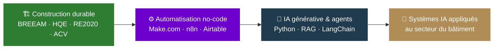

 

## 🧭 Trajectoire

 

## 🏗️ Construction durable

## ⚙️ Automatisation & no-code

## 🧠 IA générative & agents

 

## 📊 Niveau de maîtrise

| Domaine | Progression |
|---|---|
| Construction durable | ████████████████████ 100% |
| Automatisation no-code | ████████████████░░░░ 80% |
| Python & RAG | ████████░░░░░░░░░░░░ 40% |
| Agents IA & orchestration | ████░░░░░░░░░░░░░░░░ 20% |

 

## 🚧 En construction

Documentation d'automatisations et prototypes appliqués au secteur du bâtiment : extraction de données CCTP, génération de notes techniques, études de risques naturels automatisées.

